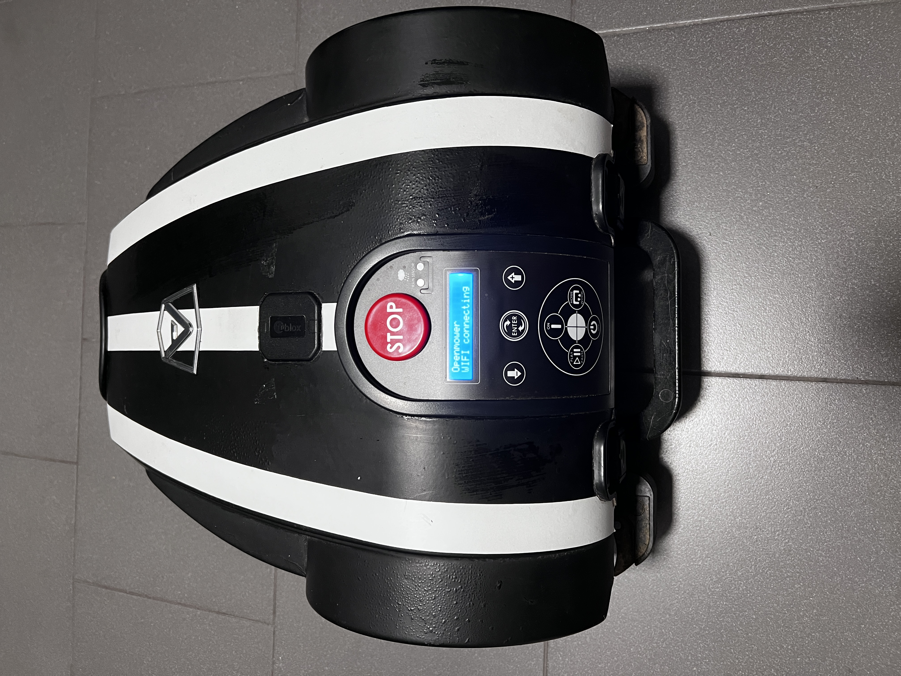

# Openmower - Ambrogio - L3x
Convert Ambrogio L30 mower to [OpenMower](https://openmower.de) powered mower.

> [!WARNING]
> Please be aware that this is a working prototype, any modifications to the mower are made at your own risk.

> [!NOTE]
> Ambrogio L30 mower was used in this project, but it should work with Viper C6, Stiga Autoclip 225 and similar as well.

# Features

* All of the features of the [OpenMower](https://openmower.de)
* Rain sensor
* Lift Sensor
* Emergency push button
* Cutting with 25cm
* Integrated built-in display (optional)
* Integrated top cover panel buttons (optional)

> Comparison with Yard Force Classic 500
> * Pros:
>   * Increased cutting width (25cm)
>   * More powerful, no issues with cutting the grass
>   * Turns easier due to its geometry
>   * No issues with steep climbs (no wheel spikes needed)
>
> * Cons:
>   * Louder mowing motor (while using 4 points steel cutting blade, perhaps 12 points plastic disc is quieter?)
>   * Tilt sensor not connected

# Hardware and Tools

You will need:

* Ambrogio L30 mower or similar (Viper C6, Stiga Autoclip 225 ...)
* [Open Mower Hardware Kit](https://shop.devops.care/10-openmower)
* [Ardusimple simpleRTK2B – Basic Starter Kit](https://www.ardusimple.com/product/simplertk2b-basic-starter-kit-ip65/)
* Raspberry Pi 4 (minimum 2GB)
* SD Card 16GB+
* USB Wi-Fi Dongle
* Yard Force Classic 500 wiring harnesses (can be created from the scratch as well)
* [Vesc Tool Free](https://vesc-project.com/node/17)
* 16x2 LCD Display with I2C adapter (optional)
* Raspberry Pico W (optional)
* 2 relay module (optional)

# Assembly

## Docking station

Remove all the original electronics from the docking station.

Place 2 expansions plugs in 2 holes.

Screw the DC/DC board

> [!NOTE]
> Plug from the YardForce Classic 500 power supply was used here but the original Ambrogio power supply will work as well.
(find the positive and negative wires and connect it appropriately to the DC/DC board)

> [!NOTE]
> For all the voltage and current adjustments please follow the official [OpenMower](https://openmower.de) documentation.

## The mower

Remove all the original mower electronics.
Prepare the motor Hall sensor wires.

Prepare the motor power wires.

> [!NOTE]
> YardForce Classic 500 wiring harness was used, since it fits to the OpenMower mainboard sockets, but it can be created from the scratch as well.

> [!NOTE]
> Crimped terminals for the motor power wires were used.

> [!NOTE]
> All 3 motor harnesses have the same colouring.

Install the main switch into the mower body (power switch from the YardeForce Classic 500 was used here)
> [!NOTE]
> No need to install the power button if 2 relay board and top cover power buttons are integrated (see later in this tutorial).

Remove Ambrogio's power supply socket

Extend the circular hole to give it a rectangular shape with proper dimensions

Insert the power switch

Prepare the power supply harness.
> [!NOTE]
> Since the Ambrogio batteries have just 2 wires (positive and negative), Shottky diode was used to create separate charge + and battery + signals.

Use XT60 plugs to create the power supply harness.

Solder the female XT60 plugs to both power supply coming from the body and batteries.

Solder the male XT60 plugs to the 2 ends of the harness (see the pictures below)

